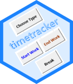

# timetracker 

-----

## Overview

Excel template that should help with recording of time worked.

The template comes with a set of *VBA*-Macros, in order to provide
support when

  - looking for the current date,
  - adding the respective day type (e.g. work, flexday, etc.),
  - inserting the timestamps for start and end, and
  - calculating the break time.

In addition, the tool calculates the time worked for each day plus the
*+/-*-values.

## Break defaults:

The calculation algorithm for computing _break times_ is in accordance with the 
German law: 

> There are also legal regulations for breaks. 
> After 6 hours of work, the employee is entitled to a rest break of 30 minutes.
> If the employee works more than 9 hours, the work must be interrupted for at 
> least 45 minutes by one or more breaks.

## Worktime Aggregation

A *pivot table* can be used to get an overview of what was recorded
(aggregated by month/calenderweek and type,resp.).
